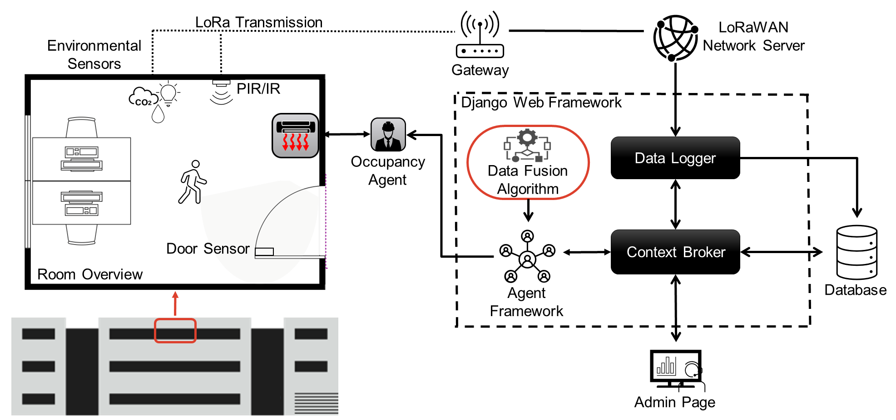

<a href="https://www.ebc.eonerc.rwth-aachen.de/">  </a>

<br/><br/>

# Building Automation Framework

<a href="https://www.fubic.energy" alt="Project logo" title="FUBIC All Electricity - Realization" height="170"/> </a>

## Overview
This backend framework, developed for the FAE-R project at RWTH, supports a cloud-based approach to occupancy monitoring designed to optimize HVAC operations in office buildings. 

Core features include:

- **Data Storage and Management**: Utilizes PostgreSQL with TimescaleDB for efficient time-series data handling.
- **Redis for Caching**: Implements Redis for fast data caching and real-time updates.
- **API Integration**: Provides a robust API for frontend interaction and external service integration.
- **User Authentication and Authorization**: Ensures secure access with comprehensive user management.
- **Scalability and Reliability**: Designed to handle large volumes of data and high user traffic.
- **Automated Deployment**: Simplifies deployment with Docker and Docker Compose.
<a>  </a>

## Getting Started

### Requirements
- [Docker](https://docs.docker.com/get-docker/)
- [Docker Compose](https://docs.docker.com/compose/install/)

### Installation

1. **Clone the Repository**
    ```sh
    git clone https://github.com/yourusername/yourrepository.git
    cd yourrepository
    ```

2. **Create a .env File**
    Create a `.env` file in the root directory with the following content:
    ```sh
    Postgres_DB=your_database_name
    Postgres_USER=your_postgres_user
    Postgres_USER_PW=your_postgres_password
    Postgres_HOST=postgres
    Postgres_PORT=5432
    ADMIN_USERNAME=your_admin_username
    ADMIN_PASSWORD=your_admin_password
    ADMIN_EMAIL=your_admin_email
    DJANGO_SECRET_KEY=your_django_secret_key
    DJANGO_DEBUG=true
    ```

3. **Build and Run the Containers**
    For development environments, use:
    ```sh
    docker-compose -f dev.docker-compose.yaml up --build
    ```
    For production deployment, use:
    ```sh
    docker-compose -f prod.docker-compose.yaml up --build
    ```

### Initial Configuration and Setup

After successfully launching the containers, follow these steps to configure the platform:

1. **Access the Admin Panel**
   - Navigate to `http(s)://<your-server-ip>:<django port>/admin` to access the Django admin panel using the credentials defined in the `.env` file.

2. **Add Building and Room**
   - Utilize the admin panel to define new buildings and rooms, setting necessary details such as location, room numbers, and capacity.

3. **Automated Sensor and Data Point Setup**
   - Sensors and corresponding data points for environmental monitoring will be automatically set up when a room is added.

4. **Configure Occupancy Detection**
   - Define occupancy detection tasks to analyze room usage and optimize building efficiency.

### Production Visualization Tools

When using the `prod.docker-compose.yaml` for deploying in a production environment, the following visualization tools are available:

- **Grafana for Visualization**
   - Access Grafana at `http(s)://<your-server-ip>:<django port>/grafana/`. Use the username and password defined in your `.env` file for login. This platform provides advanced data visualization capabilities.

- **pgAdmin for Database Management**
   - Manage your PostgreSQL database with pgAdmin at `http(s)://<your-server-ip>:<django port>/pgadmin/`. Login with the credentials set in your `.env` file. This tool offers comprehensive database management functionalities.

### Stopping the Containers
For development:
```sh
docker-compose -f dev.docker-compose.yaml down
```
For production:
```sh
docker-compose -f prod.docker-compose.yaml down
```

### Rebuilding the Containers
For development:
```sh
docker-compose -f dev.docker-compose.yaml up --build
```
For production:
```sh
docker-compose -f prod.docker-compose.yaml up --build
```

## Documentation

### Components and Their Functionalities

#### ba_framework
This folder contains the main configuration and setup for the Django application, including Dockerfiles for creating Docker images and defining the application's environment.

#### agents
Responsible for handling various tasks within the framework, including:
- **Energy Efficiency Tasks**: Monitoring and optimizing energy usage.
- **KPI Analysis**: Analyzing key performance indicators to improve system performance and user comfort.

The agents folder within the system handles automated tasks using Celery, an asynchronous task queue based on distributed message passing. The system schedules and executes these tasks, such as occupancy detection in rooms, using Celery Beat, a scheduler that triggers periodic tasks that are then executed by Celery workers.

### Context broker
The Context Broker utilizes the Django ORM (Object-Relational Mapping). Django ORM is a powerful tool for data management, allowing developers to interact with database data in a high-level, object-oriented manner. It abstracts SQL queries into Python code, making database operations more intuitive and maintaining code more maintainable.

#### ba_framework 
Contains the core configuration files for the Django project, such as settings, URLs, ASGI and WSGI configurations, and Celery setup for asynchronous task handling.

#### data_points
Manages the data points within the application, including operations, processing, and metadata management for these data points.

#### logger
Responsible for logging activities within the application. It includes configurations for logging models, views, WebSocket consumers for real-time logging, and admin interface setups.

#### rest_api
Defines the REST API for the application, including models, serializers, views, and URL configurations necessary for API operations.

#### mqtt_client
Handles MQTT communication for collecting and processing sensor data. This includes the main MQTT client script, logging, and libraries for interacting with MQTT brokers and handling sensor data.

#### nginx
Contains configuration files and Docker setup for Nginx, which is used as a web server and reverse proxy for the application. It includes separate configurations for development and production environments.

### Deployment and Environment Configuration
- **dev.docker-compose.yaml**: Configuration for setting up the development environment using Docker Compose.
- **pro.docker-compose.yaml**: Configuration for setting up the production environment using Docker Compose.

## Copyright and license

This project is licensed under the [MIT][license-M] License.

<a href="https://www.bmwk.de/Navigation/DE/Home/home.html">  </a>

[license-image-M]: https://img.shields.io/badge/license-MIT-blue
[license-M]: http://doge.mit-license.org
