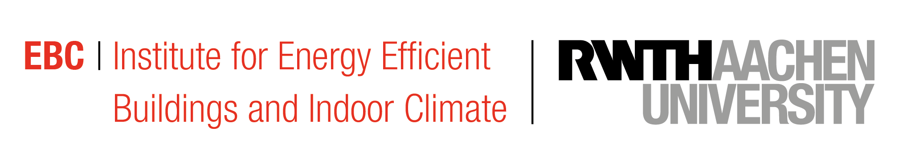

<a href="https://www.ebc.eonerc.rwth-aachen.de/">  </a>

<br/><br/>

# Building Automation Framework

<a href="https://www.fubic.energy" alt="Project logo" title="FUBIC All Electricity - Realization" height="170"/> </a>

## Overview
This backend framework, developed for the FAE-R project at RWTH, supports a cloud-based approach to occupancy monitoring designed to optimize HVAC operations in office buildings. 

Core features include:

- **Data Storage and Management**: Utilizes PostgreSQL with TimescaleDB for efficient time-series data handling.
- **Redis for Caching**: Implements Redis for fast data caching and real-time updates.
- **API Integration**: Provides a robust API for frontend interaction and external service integration.
- **User Authentication and Authorization**: Ensures secure access with comprehensive user management.
- **Scalability and Reliability**: Designed to handle large volumes of data and high user traffic.
- **Automated Deployment**: Simplifies deployment with Docker and Docker Compose.
<a>  </a>
## Getting Started

### Requirements
- [Docker](https://docs.docker.com/get-docker/)
- [Docker Compose](https://docs.docker.com/compose/install/)

### Installation

1. **Clone the Repository**
    ```sh
    git clone https://github.com/yourusername/yourrepository.git
    cd yourrepository
    ```

2. **Create a .env File**
    Create a `.env` file in the root directory with the following content:
    ```sh
    Postgres_DB=your_database_name
    Postgres_USER=your_postgres_user
    Postgres_USER_PW=your_postgres_password
    Postgres_HOST=postgres
    Postgres_PORT=5432
    ADMIN_USERNAME=your_admin_username
    ADMIN_PASSWORD=your_admin_password
    ADMIN_EMAIL=your_admin_email
    DJANGO_SECRET_KEY=your_django_secret_key
    DJANGO_DEBUG=true
    EXPO_TOKEN=your_expo_token
    ```

3. **Build and Run the Containers**
    ```sh
    docker-compose -f dev.docker-compose.yaml up --build
    ```

### Stopping the Containers
    ```sh
    docker-compose -f dev.docker-compose.yaml down
    ```

### Rebuilding the Containers
    ```sh
    docker-compose -f dev.docker-compose.yaml up --build
    ```

## Documentation

### Components and Their Functionalities

#### ba_framework
This folder contains the main configuration and setup for the Django application, including Dockerfiles for creating Docker images and defining the application's environment.

#### agents
Responsible for handling various tasks within the framework, including:
- **Energy Efficiency Tasks**: Monitoring and optimizing energy usage.
- **KPI Analysis**: Analyzing key performance indicators to improve system performance and user comfort.

#### ba_framework 
Contains the core configuration files for the Django project, such as settings, URLs, ASGI and WSGI configurations, and Celery setup for asynchronous task handling.

#### data_points
Manages the data points within the application, including operations, processing, and metadata management for these data points.

#### logger
Responsible for logging activities within the application. It includes configurations for logging models, views, WebSocket consumers for real-time logging, and admin interface setups.

#### rest_api
Defines the REST API for the application, including models, serializers, views, and URL configurations necessary for API operations.

#### mqtt_client
Handles MQTT communication for collecting and processing sensor data. This includes the main MQTT client script, logging, and libraries for interacting with MQTT brokers and handling sensor data.

#### nginx
Contains configuration files and Docker setup for Nginx, which is used as a web server and reverse proxy for the application. It includes separate configurations for development and production environments.

### Deployment and Environment Configuration
- **dev.docker-compose.yaml**: Configuration for setting up the development environment using Docker Compose.
- **pro.docker-compose.yaml**: Configuration for setting up the production environment using Docker Compose.

## Copyright and license

This project is licensed under the [MIT][license-M] License.

<a href="https://www.bmwk.de/Navigation/DE/Home/home.html">  </a>

[license-image-M]: https://img.shields.io/badge/license-MIT-blue
[license-M]: http://doge.mit-license.org
